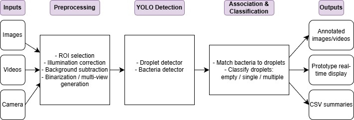
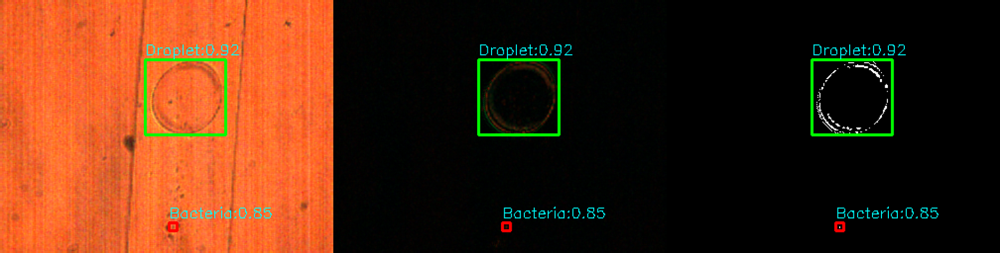
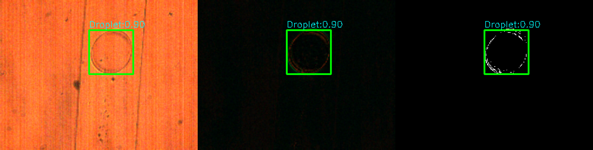
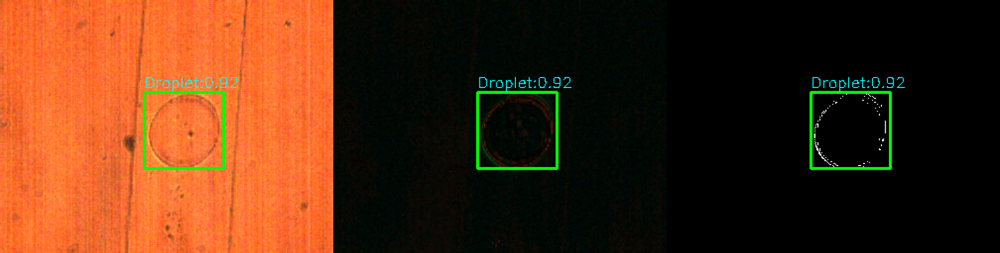

# Microfluidic Droplet and Bacteria Detection  
Engineering Internship Project – ICube / Université de Strasbourg  
Gabrielle Sacramento Teixeira Matos – Télécom Physique Strasbourg (Promotion 2026)

**Note:**  
This repository presents a high-level overview of the project developed during my engineering internship at ICube (Université de Strasbourg), within the IRUPP research project.  
No confidential code, experimental data, or proprietary material is shared here.

---

## 1. Project Overview

Microfluidic droplet-based systems allow the study of biological and chemical processes inside isolated micro-environments. Within the IRUPP project (Iron Uptake Pathways in *Pseudomonas aeruginosa*), this internship focused on automating the analysis of microfluidic experiments through the development of an end-to-end pipeline capable of:

- Automatically detecting microdroplets in microscopy images  
- Automatically identifying their bacterial content (empty, single bacterium, multiple bacteria)  
- Producing structured outputs suitable for downstream biological analysis with minimal human intervention  
- Operating in a prototype real-time mode  

The pipeline combines computer vision methods, deep learning models (YOLO), dedicated preprocessing stages, and data annotation workflows.

---

## 2. Context

- Laboratory: ICube – UMR 7357, Université de Strasbourg  
- Host team: EM3 – Électronique, Microélectronique et Modélisation  
- Research project: IRUPP (Iron Uptake Pathways in *P. aeruginosa*)  
- Internship period: June–September 2025  

The objective of the internship aligns with IRUPP’s need to identify droplets containing exactly one bacterium, a key condition for studying phenotypic switching mechanisms.

---

## 3. Methodological Approach

### 3.1 Preprocessing
A modular preprocessing pipeline was designed to improve contrast, mitigate illumination variations and reduce background noise. Techniques included:

- Illumination correction  
- Background subtraction  
- Thresholding and binarization  
- Normalization and ROI filtering  
- Generation of multi-view representations (original, background-subtracted, binary)

### 3.2 Dataset and Annotation  
According to the internship report:  
- 1,234 images were used for droplet training and validation (complete dataset available at the time)  
- 500 images were annotated for bacteria detection and used for bacteria training and validation (complete dataset available at the time)  
- Annotations were performed with Roboflow  
- Multi-view annotation improved the visibility of bacteria under limited contrast conditions

### 3.3 Model Training (YOLO)
Two YOLO-based detectors were trained:

- Droplet detector trained on 1,234 annotated images  
- Bacteria detector trained on 500 preprocessed and annotated images  

Performance metrics (from the internship report):  
Precision of 0.90 for the bacteria class and 0.97 for the droplet class, with a global mAP50 of 0.956.

### 3.4 Pipeline Overview


### 3.5 Pipeline Integration
A unified pipeline was implemented with the following capabilities:

- Droplet detection only  
- Bacteria detection only  
- Joint droplet + bacteria detection  
- Bacteria-within-droplet classification  
- Batch and video processing  
- CSV export and annotated media generation  
- Prototype real-time mode using webcam input

---

## 4. Results Summary

The results obtained during the internship demonstrate:

- Robust droplet detection across varied experimental conditions  
- Successful classification of droplets into three biologically relevant categories: empty droplets, droplets containing a single bacterium, and droplets containing multiple bacteria  
- Consistent detection of bacteria despite limited visibility conditions  
- Stable model convergence documented in the report (loss curves, PR curves, confusion matrices)  
- A functional real-time prototype, ready for further testing on hardware-equipped setups  
- The dataset allowed reliable detection of bacteria outside the droplets, but bacteria inside the droplets could not be observed due to the absence of contrast in the liquid, making intra-droplet detection difficult to annotate or train.

Limitations noted in the report include dataset size, contrast variability and the need for additional annotated data to strengthen bacteria detection robustness.

### Detection Examples




---

## 5. Repository Structure

This repository is documentation-oriented and does not contain source code or experimental data (confidential).  
The structure is:
```markdown
README.md               → High-level description of the internship project  
result1.png             → Droplet and bacteria detection example  
result2.png             → Droplet and bacteria detection example  
result3.png             → Droplet and bacteria detection example  
pipeline_diagram.jpg    → Schematic representation of the processing pipeline 
```

---

## 6. Contact  
For further information, please reach out directly.
LinkedIn: https://www.linkedin.com/in/gabriellestmatos/


